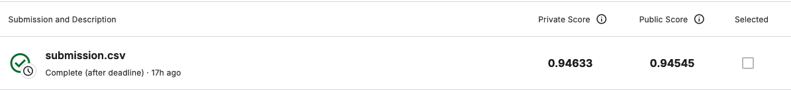

# Toxic Comment Classification

This repository contains the solution for the [Jigsaw Toxic Comment Classification Challenge](https://www.kaggle.com/competitions/jigsaw-toxic-comment-classification-challenge/overview) hosted on Kaggle. The task is to build a multi-headed model capable of detecting different types of toxicity such as threats, obscenity, insults, and identity-based hate.

## Objective

The goal of this project is to improve upon existing models, like the one provided by the Perspective API, and help facilitate healthier online discussions. Our model classifies the following categories of toxic comments:

- Toxic
- Severe toxic
- Obscene
- Threat
- Insult
- Identity hate

## Model Overview

A **Long Short-Term Memory (LSTM)** model was developed and trained on the provided Wikipedia Talk page dataset, achieving the following results:

| **Private Score** | **Public Score** |
| ----------------- | ---------------- |
| 0.94633           | 0.94545          |

  

## Dataset

The dataset includes a large collection of Wikipedia comments which have been labeled for different types of toxicity. You can access the dataset and more details about the competition [here](https://www.kaggle.com/competitions/jigsaw-toxic-comment-classification-challenge/overview).

> Disclaimer: The dataset contains text that may be considered offensive or inappropriate.

## Evaluation

The model is evaluated using **Mean Column-wise ROC AUC**. This metric averages the AUC score for each of the six target labels to produce a single score.

## Conclusion

This project demonstrates the effectiveness of using LSTM for multi-label text classification, especially in detecting toxic language across various categories. With a solid performance as shown in the scores, this solution can be a stepping stone towards more respectful and productive online conversations.

ZAFER MESUT BILEN

zafer@bilen.dev

[bilen.dev](https://bilen.dev)
